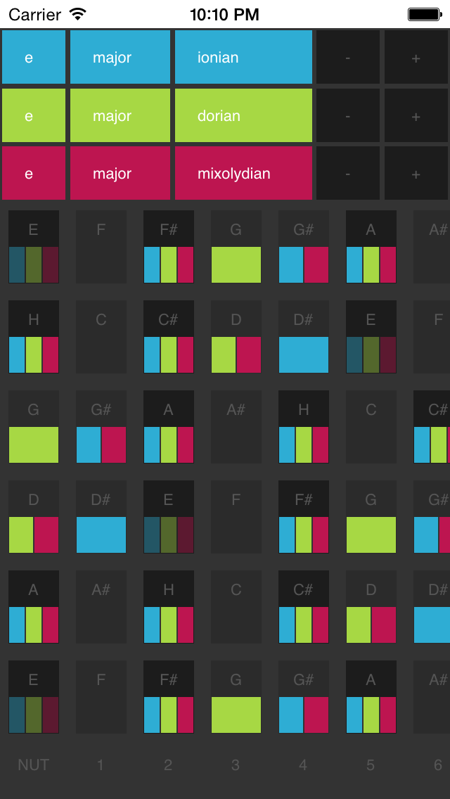

A guitarists guide to improvisation - look up any overlapping notes from different scales all across the guitar neck, and find sweet sounding tones for your solos; blue notes, dorian sounds, mixolydian sounds, etc.

[http://torgeir.github.io/scales](http://torgeir.github.io/scales)

Built using omniscient and es6 (webpack and the 6to5-loader).

### install

`npm i`

### watch (hot reloads with [react-hot-loader](https://github.com/gaearon/react-hot-loader)!)

`npm run watch`

### build for prod

`npm run build`
